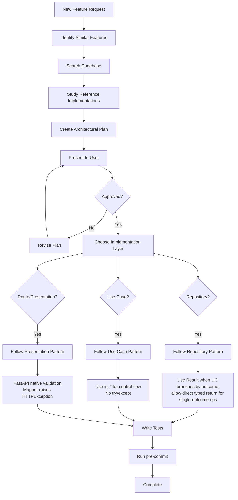

# Repository Guidelines

## Code Style
- Do NOT write verbose "LLM-style" comments that merely restate what the code does. Comments should only explain **why**, not **what**.
- No comments like `# Create the user`, `# Return the result`, `# Initialize the settings`, `# Check if found`.
- Docstrings are allowed on public APIs but must be concise and add value beyond the signature.
- Prefer self-documenting code (clear names, small functions) over inline comments.

## Project Structure & Module Organization
- `src/` contains the FastAPI application. Entry points live in `src/main.py` and server config in `src/gunicorn_config.py`.
- `src/core/` houses shared infrastructure (db, settings, logging), while `src/features/` groups domain modules.
- `tests/` holds unit and integration tests, with deeper suites in `tests/integration/`, `tests/prometheus/`, and `tests/test_src/`.
- `alembic/` includes migrations; new revisions go in `alembic/versions/`.
- `prometheus/` contains monitoring assets, and `docker-compose.yml` defines local services (API, Postgres, Redis).

## Pre-Implementation Workflow

Before implementing any new feature, ALWAYS follow this process:

1. **Identify Similar Features**: Search the codebase for similar implementations
   - For endpoints: look in `src/features/*/presentation/routers/`
   - For repositories: check `src/features/*/domain/repository/`
   - For use cases: examine `src/features/*/domain/use_cases/`

2. **Study Reference Implementations**: Read the canonical examples (see Reference Implementations section below)

3. **Present Architectural Plan**: Before writing code, show:
   - Which patterns you'll follow
   - Key classes/methods you'll create
   - How it maps to existing examples
   - Wait for approval before proceeding

4. **Verify Patterns**: Cross-check your approach against the Error Handling Patterns section below

## Mandatory Local Compliance Gate
- `AGENTS.md` rules in this repository are blocking requirements.
- Before coding, explicitly map planned changes to these rules.
- Before finalizing, run `uv run python scripts/check_architecture_guards.py` and ensure it passes.
- Violations of these rules invalidate the implementation even if tests pass.

## Implementation Decision Flow



## Layer Responsibilities
- Presentation (`src/features/*/presentation`): FastAPI routers, request/response schemas, dependency wiring, and HTTP exception mapping. No direct third-party infra usage beyond FastAPI/Starlette.
- Domain (`src/features/*/domain`): entities, use cases, and repository interfaces. No dependencies on specific SDKs/clients (jwt, redis, sqlalchemy, http).
- Data (`src/features/*/data`): repository implementations and datasource adapters. Datasources may depend on concrete libraries (jwt/redis/sqlalchemy/http), repositories orchestrate datasources and map to domain. Persistence/transport models stay in `data/*` and do not escape the data layer.
- Core (`src/core`): cross-cutting infrastructure (settings, logging, DB/Redis clients, middleware).

## Error Handling Patterns

### Repository Layer Pattern

Repositories SHOULD use Result objects for operations with business-meaningful outcome variants.
Result objects are mandatory when use cases branch by repository outcome.
For single-outcome operations where use cases do not branch by repository status, direct typed returns are allowed.

**Pattern Structure:**
- Abstract base class with `is_*()` query methods
- Success/NotFound/Error result subclasses
- Query methods return status, getter methods return data or raise

**Example** (from `src/features/auth/domain/repository/user.py`):
```python
class GetUserRepositoryResult(ABC):
    @abstractmethod
    def is_found(self) -> bool:
        raise NotImplementedError

    @abstractmethod
    def get_user(self) -> UserEntity:
        raise NotImplementedError

class GetUserSuccessRepositoryResult(GetUserRepositoryResult):
    def is_found(self) -> bool:
        return True

    def get_user(self) -> UserEntity:
        return self.__user

class GetUserNotFoundRepositoryResult(GetUserRepositoryResult):
    def is_found(self) -> bool:
        return False

    def get_user(self) -> UserEntity:
        raise ValueError  # No data available
```

**Rules:**
- Use Result objects (`is_*`) when the use case branches on repository outcomes (found/not found, validation, permission, conflict)
- For single-outcome operations, direct typed returns (`Entity`, `list[Entity]`, `bool`, etc.) are allowed
- Never use try/except to determine business result type
- Getter methods on error Result objects should raise ValueError

### Avoiding Over-Abstraction in Repositories

Repositories should not create unnecessary helper methods that only wrap datasource calls.

**Anti-pattern - Useless abstraction:**
```python
class FeatureFlagsRepository:
    def _build_context(self, user_id: UUID) -> dict:
        return {"userId": str(user_id)}

    def _check_feature(self, name: str, context: dict) -> bool:
        return self._datasource.is_enabled(name, context)

    async def is_premium_enabled(self, user_id: UUID) -> bool:
        context = self._build_context(user_id)
        return self._check_feature("premium", context)
```

**Good - Direct call with inline context:**
```python
class FeatureFlagsRepository:
    async def is_premium_enabled(self, user_id: UUID) -> bool:
        try:
            return self._datasource.is_enabled(
                "premium",
                {"userId": str(user_id)}
            )
        except Exception as e:
            logger.error(f"Error checking premium: {e}")
            return False
```

**When to create helper methods:**
- Complex logic repeated 3+ times across methods
- Clear business meaning (not just "build dict" or "call datasource")
- Significant error handling or transformation logic

**When to use documentation instead:**
- Patterns that need adaptation per use case
- Simple transformations (like dict building)
- Write comprehensive docstrings with concrete examples

### Use Case Layer Pattern

Use cases check repository results via methods, NEVER via try/except.

**Example** (from `src/features/auth/domain/use_cases/register_by_email/use_case.py`):
```python
async def _run(self, params: Params) -> UseCaseResult:
    ban = await self.__user_ban_repository.get_ban(...)
    if ban.is_banned():
        return UserBannedError()

    get_user_result = await self.__user_repository.get_by_email(params.email)
    if get_user_result.is_found():
        return UserAlreadyExistsError()

    # Success path
    user = await self.__user_repository.add_by_email(...)
    return Success()
```

**Rules:**
- Use `if result.is_*():` for control flow
- Return `UseCaseSuccess` or `UseCaseError` subclasses
- No try/except for control flow (only for unexpected errors)

### Wide Logging In Use Cases

Wide logging via `ILogContextRepository` is mandatory for all domain use cases (`src/features/*/domain/use_case*/**/use_case.py`).

**Rules:**
- Constructor MUST accept `log_context_repository: ILogContextRepository`
- `_run(...)` MUST call `emit_input(...)` before business flow starts
- Every terminal branch (`return` with success/error) MUST call `emit_result(result=...)` first
- SL containers SHOULD wire this dependency via `CoreRepositoryContainer.get_log_context_repository()`
- Domain use cases should not write logs directly via framework loggers; use log context events instead

**Enforcement:**
- Guarded by `scripts/check_architecture_guards.py`
- Temporary legacy exceptions are explicitly listed in the guard script and should be reduced over time

### Domain Filesystem Pattern (Auth-Style)

New feature domain modules MUST follow the `auth` layout:

```text
src/features/<feature>/domain/
  entities/
    <entity_1>.py
    <entity_2>.py
  repository/
    <entity_1>.py
    <entity_2>.py
  use_cases/
    <operation_1>/
      use_case.py
      results.py
      mapper.py
    <operation_2>/
      use_case.py
      results.py
      mapper.py
```

**Rules:**
- Use `repository` (singular) as canonical folder name for domain repository contracts
- One repository contract should correspond to one primary entity/aggregate, not the whole bounded context
- Multi-entity repository contracts are exceptional; before implementing such a case, stop and ask the user for a decision
- Keep use-case structure operation-local (`use_cases/<operation>/use_case.py`, `results.py`, `mapper.py`)
- Domain layer contains contracts and business models only; no data-layer or presentation-layer imports

### Presentation Layer Pattern

Routes use FastAPI native validation, mappers raise HTTPException.

**Path Parameter Validation** (from `src/features/rbac/presentation/routers/roles/get_role/route.py`):
```python
@router.get("/{role_id}")
async def get_role(
    role_id: UUID,  # FastAPI validates automatically - returns 422 if invalid
    use_case: GetRoleUseCase = Depends(...),
    mapper: GetRolePresentationMapper = Depends(...),
) -> RoleResponse:
    result = await use_case(GetRoleParams(role_id=role_id))
    return result.map(mapper)  # Mapper raises HTTPException on errors
```

**Rules:**
- Use FastAPI types (UUID, Literal, Enum, int) for path/query validation
- No try/except in route handlers for validation
- Custom HTTPException classes in `presentation/exceptions/`
- Mapper methods raise HTTPException, not route handlers

### Presentation Filesystem Pattern (Auth-Style)

New feature presentation routers MUST follow the `auth` layout:

```text
src/features/<feature>/presentation/
  exceptions/
  schemas/
  routers/
    router.py
    <operation_1>/
      dependencies.py
      route.py
      mapper.py  # or mapper/<variant>.py
    <operation_2>/
      dependencies.py
      route.py
      mapper.py  # or mapper/<variant>.py
```

**Rules:**
- Do not introduce intermediate grouping layers with shared `mapper.py`/`dependencies.py` (for example `routers/properties/mapper.py`)
- Keep dependency wiring and mapper classes operation-local (`routers/<operation>/`)
- `routers/router.py` only aggregates `include_router(...)`
- To avoid mapping duplication, response schemas may and should define `@staticmethod map(...)` for domain-entity to HTTP schema conversion

### Data Filesystem Pattern (Auth-Style)

New feature data modules MUST follow this layout:

```text
src/features/<feature>/data/
  datasource/
    <component_1>/
      interface.py
      implementation.py
      data.py         # optional: ORM models
      data_model.py   # optional: datasource-local payload/data model
    <component_2>/
      interface.py
      implementation.py
      data.py
      data_model.py
  repository/
    <entity_or_aggregate_1>.py
    <entity_or_aggregate_2>.py
```

**Rules:**
- Use `datasource` (singular) and `repository` (singular) as canonical folder names for new features
- One data repository should correspond to one domain repository/entity/aggregate
- Multi-entity data repositories are exceptional; before implementing such a case, stop and ask the user for a decision
- `data.py` ORM models are datasource-internal and must not be used directly outside datasource implementations
- Datasource interfaces/implementations must use datasource-local payload/data mod