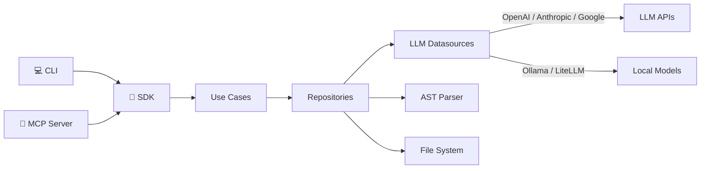

<div align="center">

# 🧠🔬 NeuralScope

**AI-powered code analysis toolkit**

*Review · Document · Graph · Scan · Test · Q&A · Health · Validate*

[](https://www.python.org/)
[](LICENSE)
[](https://github.com/astral-sh/ruff)
[](https://modelcontextprotocol.io/)
[](docs/getting-started.md)

---

**10 features** · **3 interfaces** (SDK · CLI · MCP) · **7 LLM providers**

</div>

## ⚡ Quick Start

```bash
pip install neuralscope
```

<table>
<tr>
<td width="50%">

**🐍 Python SDK**
```python
from neuralscope import NeuralScope

ns = NeuralScope(model="openai/gpt-5.2")

# AI code review
review = await ns.review("./src/service.py")

# Generate tests
tests = await ns.generate_tests("./src/utils.py")

# Ask about the codebase
answer = await ns.ask("How does auth work?")
```

</td>
<td width="50%">

**💻 CLI**
```bash
# Code review with scoring
neuralscope review ./src/service.py

# Security scan
neuralscope scan ./src

# Health dashboard
neuralscope health ./src

# Generate PR description
neuralscope pr-summary
```

</td>
</tr>
</table>

## 🎯 Features

<table>
<tr>
<td width="50%">

🔍 **Code Review**
AI-powered review with scoring, issue detection, and fix suggestions

📝 **Documentation**
Generate comprehensive docs from source code

🕸️ **Dependency Graph**
AST-based module graph with change impact analysis

🛡️ **Vulnerability Scan**
AI security audit with CWE mapping and recommendations

🧪 **Test Generator**
Generate pytest tests with edge cases

</td>
<td width="50%">

💬 **Codebase Q&A**
Ask questions about your code — RAG-powered answers with source refs

📊 **Health Dashboard**
Complexity metrics, hotspots, health score (0–10)

📋 **PR Summary**
Auto-generate PR descriptions from diffs

🎨 **Prompt Studio**
Create and manage reusable prompt profiles

🏛️ **Architecture Validator**
Validate architecture rules against your codebase

</td>
</tr>
</table>

## 🏗️ Architecture



```
neuralscope/
├── core/           # Settings, LLM registry, cache, tracing
├── features/       # 10 domain modules (Clean Architecture)
│   └── <feature>/
│       ├── domain/    # Entities, contracts, use cases
│       └── data/      # Datasources, implementations
├── sdk/            # Python SDK client
├── cli/            # Typer + Rich (14 commands)
└── mcp/            # MCP server (11 tools + 1 resource)
```

## 🤖 LLM Providers

| Provider | Models | Setup |
|:---------|:-------|:------|
| **OpenAI** | GPT-5.2, GPT-5.1, o3, o4-mini | `OPENAI_API_KEY` |
| **Anthropic** | Claude Sonnet 4.6, Opus 4.6 | `ANTHROPIC_API_KEY` |
| **Google** | Gemini 3 Pro, Gemini 3 Flash | `GOOGLE_API_KEY` |
| **Ollama** | Llama 4, Qwen 3, Deepseek R1 | Local install |
| **Azure** | Your deployments | `AZURE_*` vars |
| **OpenRouter** | Any model via proxy | `OPENROUTER_API_KEY` |
| **LiteLLM** | Any model via proxy | `LITELLM_API_BASE` |

## 🔌 MCP Server

Connect NeuralScope to any MCP-compatible AI assistant:

```json
{
  "mcpServers": {
    "neuralscope": {
      "command": "neuralscope-mcp"
    }
  }
}
```

11 tools: `review` · `docs` · `build_graph` · `impact` · `scan` · `generate_tests` · `ask` · `health` · `pr_summary` · `validate_arch` · `list_models`

## 🐳 Docker

```bash
docker compose up -d    # NeuralScope + Qdrant
```

## 🧑‍💻 Development

```bash
git clone https://github.com/neuralscope/neuralscope.git
cd neuralscope
poetry install
poetry run pytest         # Run tests
poetry run mkdocs serve   # Local docs
```

## 📄 License

[MIT](LICENSE)
